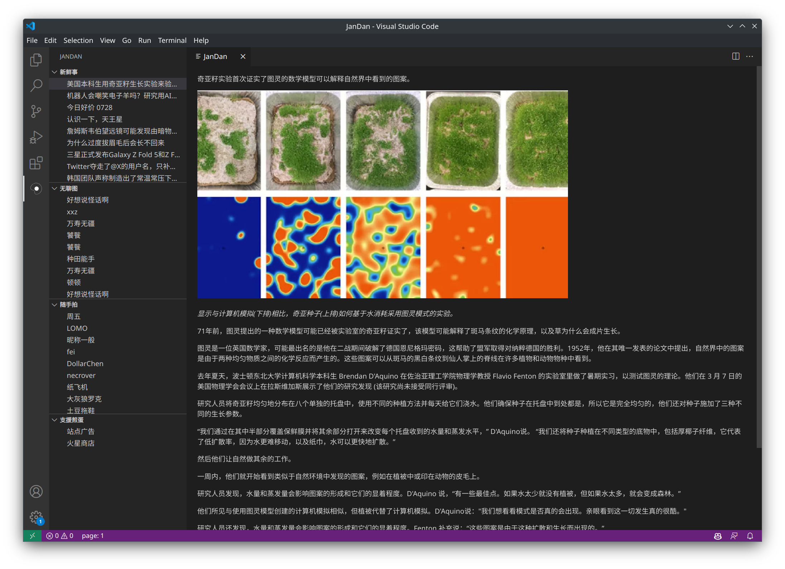

# JanDan

An unofficial VS Code extension for JanDan.



## Installation

[JanDan](https://marketplace.visualstudio.com/items?itemName=TaipaXu.jandan-vscode)

## Development & Building

### Prerequisites

```sh
$ git clone https://github.com/TaipaXu/jandan-vscode.git
$ cd jandan-vscode
$ pnpm i
```

### Development

```sh
$ pnpm run dev
```

### Building

```sh
$ pnpm run build
```

### Packaging

```sh
$ pnpm run package
```

## License

[GPL-3.0](LICENSE)
