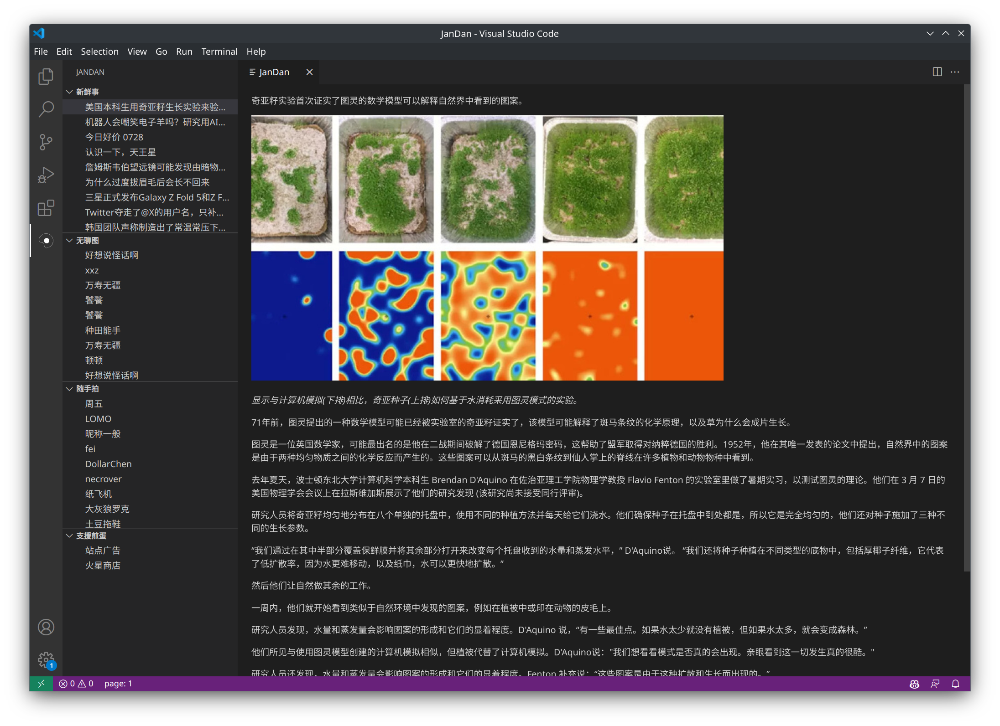

# JanDan

Language: English | [中文](./README.zh-CN.md)

[VS Code Marketplace](https://marketplace.visualstudio.com/items?itemName=TaipaXu.jandan-vscode) | [Repository](https://github.com/TaipaXu/jandan-vscode)

JanDan is an unofficial VS Code extension for [jandan.net](https://jandan.net/). It adds a JanDan activity bar view for browsing hot lists, fresh posts, image comments, casual photos, cross-dressing posts, Tree Hole, Q&A, and support links without leaving VS Code.

## Preview



## Features

- Activity bar container with Hot Lists, Fresh News, Boring Pics, Casual Photos, Cross-Dressing, Tree Hole, Q&A, and Support views.
- Hot Lists includes 4-hour hot, Boring Pics, Tree Hole, Q&A, Casual Photos, 3-day best, and 7-day best categories.
- Paged browsing with previous, next, and refresh actions for JanDan feeds.
- Webview rendering for posts and image collections.
- `oo` and `xx` vote actions for supported image entries.
- External support links opened through VS Code.

## Tech Stack

- [Vite+](https://viteplus.dev/guide/) as the unified toolchain and `vp` CLI.
- [VS Code Extension API](https://code.visualstudio.com/api) for tree views, commands, and webviews.
- [TypeScript](https://www.typescriptlang.org/) for extension code.
- Native `fetch` for JanDan API requests.

## Runtime

- Node.js: `24.17.0`
- Package manager: `pnpm@11.5.2`
- VS Code engine: `^1.125.0`
- Vite+ reads these settings from `package.json`.

## Development

Install dependencies:

```bash
vp install
```

Start the extension build watcher:

```bash
vp run dev
```

Open this folder in VS Code and launch `Run Extension` from the Run and Debug panel to start an Extension Development Host.

## Build

Run the project build script through Vite+:

```bash
vp run build
```

The production build writes the extension entry to:

```text
out/extension.js
```

## Packaging

Create a local VSIX package:

```bash
vp run package
```

## Validation

```bash
vp run check
```

This runs the configured Vite+ formatting and lint checks. Use `vp check --fix` when you want Vite+ to format and auto-fix supported issues directly.

Run `vp help` to see the full list of Vite+ commands, or `vp <command> --help` for command-specific help.

## License

This project is licensed under the [GPL-3.0 License](./LICENSE).
